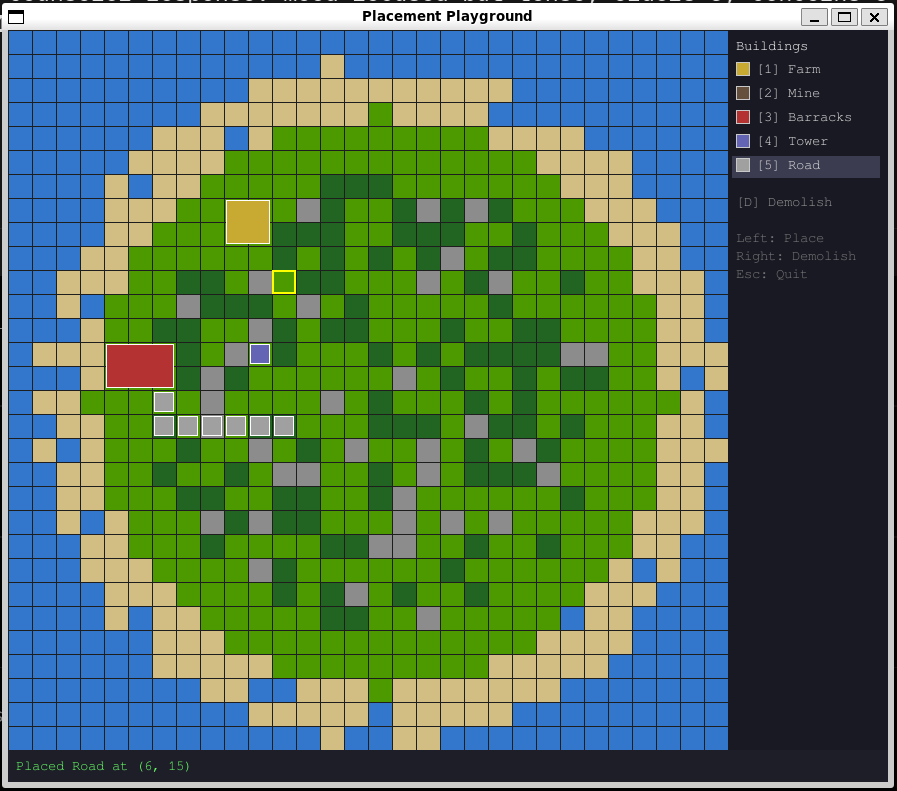

# Placement Playground

The first visual integration test of the tick-engine ecosystem. An interactive pygame application where you place and demolish buildings on a procedurally generated island, validating that five tick-engine packages work together in a real-time loop.



## Running

From the workspace root:

```bash
uv run --directory examples/placement python main.py
```

This creates an isolated virtualenv under `examples/placement/.venv` with pygame and the five required tick-engine packages resolved from the monorepo via editable path sources.

**Requirements**: Python 3.11+, a display server (X11/Wayland). pygame is the only external dependency.

## Controls

| Input | Action |
|-------|--------|
| `1` - `5` | Select building (Farm, Mine, Barracks, Tower, Road) |
| Left click | Place selected building at cursor |
| Right click | Demolish structure at cursor |
| `D` | Toggle demolish mode (left click demolishes instead of placing) |
| `Esc` | Quit |

The sidebar shows available buildings with color swatches and hotkeys. The status bar at the bottom reports placement results and errors.

## Game Design

### Terrain

The map is a 30x30 procedurally generated island. Terrain is assigned radially from center using seeded RNG:

| Terrain | Passable | Properties | Color |
|---------|----------|------------|-------|
| Grass | Yes | `terrain: "grass"` | Green |
| Forest | Yes | `terrain: "forest"`, `trees: True`, move_cost 3.0 | Dark green |
| Stone | Yes | `terrain: "stone"`, `rocky: True` | Gray |
| Sand | Yes | `terrain: "sand"` | Tan |
| Water | No | -- | Blue |

Water forms the outer ring and cannot be built on. Interior cells are a stochastic mix of grass, forest, and stone.

### Buildings

| Building | Key | Footprint | Terrain Requirement | Notes |
|----------|-----|-----------|---------------------|-------|
| Farm | `1` | 2x2 | `terrain: "grass"` | Standard placement rules |
| Mine | `2` | 2x2 | `rocky: True` | Only on stone terrain |
| Barracks | `3` | 3x2 | `terrain: "grass"` | Largest footprint |
| Tower | `4` | 1x1 | None | Any passable cell |
| Road | `5` | 1x1 | None | Stackable -- can overlap other roads |

Placement is validated on every command: the blueprint must exist, all footprint cells must be in bounds, terrain requirements must match, cells must be passable, and (unless the building is stackable) no non-stackable structure may already occupy the tiles.

## Architecture: How tick-engine Packages Are Used

This example wires together five of the twelve tick-engine packages. Each handles a distinct concern in the placement pipeline.

### tick (core engine)

Provides the ECS world, fixed-timestep clock, and system runner.

```python
from tick import Engine

engine = Engine(tps=10, seed=42)
engine.world.register_component(Structure)
engine.world.register_component(Pos2D)

engine.add_system(make_command_system(queue, on_reject=on_reject))

# In the game loop (called at fixed rate via accumulator):
engine.step()
```

**APIs used**: `Engine(tps, seed)`, `engine.step()`, `engine.world` (`register_component`, `spawn`, `despawn`, `attach`, `get`, `has`, `query`), `engine.add_system()`.

### tick-command (command queue)

Bridges the gap between pygame's event-driven input and the tick engine's fixed-rate step loop. Commands are enqueued at any time and drained on the next `engine.step()`.

```python
from tick_command import CommandQueue, make_command_system, resolve_footprint

queue = CommandQueue()

# Register typed handlers
queue.handle(PlaceStructure, handle_place)
queue.handle(Demolish, handle_demolish)

# Add the drain system to the engine
engine.add_system(make_command_system(queue, on_reject=on_reject))

# Enqueue from pygame events (between ticks)
queue.enqueue(PlaceStructure(name="farm", x=5, y=10))
```

Command types are frozen dataclasses dispatched by type. Handlers receive `(cmd, world, ctx)` and return `True` (accepted) or `False` (rejected). `resolve_footprint((x, y), (w, h))` expands an origin and shape into the full list of occupied coordinates.

### tick-spatial (spatial indexing)

Tracks entity positions on a 2D grid for occupancy checks and rendering.

```python
from tick_spatial import Grid2D, Pos2D

grid = Grid2D(width=30, height=30)

# On placement accept:
grid.place(eid, (x, y))

# On demolish:
grid.remove(eid)

# Occupancy check in handler:
entities_at = grid.at((x, y))

# Rendering iteration:
for eid in grid.tracked_entities():
    pos = grid.position_of(eid)
```

**APIs used**: `Grid2D(width, height)`, `grid.place()`, `grid.remove()`, `grid.at()`, `grid.tracked_entities()`, `grid.position_of()`, `Pos2D` component attached to every spawned entity.

### tick-atlas (terrain maps)

Stores per-cell terrain data and validates placement requirements against cell properties.

```python
from tick_atlas import CellDef, CellMap

GRASS = CellDef(name="grass")
WATER = CellDef(name="water", passable=False)
STONE = CellDef(name="stone", properties={"rocky": True})

cellmap = CellMap(default=VOID)
cellmap.set((x, y), GRASS)

# Terrain validation in handler:
cellmap.matches((x, y), {"terrain": "grass"})   # True if cell is grass
cellmap.matches((x, y), {"rocky": True})         # True if cell has rocky property
cellmap.passable((x, y))                         # False for water
```

The `CellMap` uses a `"void"` default (impassable) so that `matches()` returns `False` for any coordinate that was never explicitly set. All 900 cells on the island are explicitly stored during generation.

**APIs used**: `CellDef(name, passable, move_cost, properties)`, `CellMap(default)`, `cellmap.set()`, `cellmap.at()`, `cellmap.matches()`, `cellmap.passable()`.

### tick-blueprint (entity templates)

Defines building templates with component data and metadata. Spawns fully-assembled entities in one call.

```python
from tick_blueprint import BlueprintRegistry

bp = BlueprintRegistry()
bp.define("farm", {
    "game.components.Structure": {"name": "farm"},
    "tick_spatial.types.Pos2D":  {"x": 0, "y": 0},
}, meta={
    "footprint": (2, 2),
    "terrain_reqs": {"terrain": "grass"},
    "label": "Farm",
    "key": "1",
})

# Spawn with position override:
eid = bp.spawn(world, "farm", overrides={
    "tick_spatial.types.Pos2D": {"x": 5, "y": 10},
})

# Metadata access (used by handlers, renderer, palette, hover preview):
meta = bp.meta("farm")
footprint = meta["footprint"]      # (2, 2)
terrain_reqs = meta["terrain_reqs"] # {"terrain": "grass"}
```

**APIs used**: `BlueprintRegistry()`, `bp.define(name, components, meta)`, `bp.spawn(world, name, overrides)`, `bp.has(name)`, `bp.meta(name)`.

## The Tick Accumulator Pattern

pygame renders at 60 FPS. The tick engine runs at 10 TPS. These two rates are decoupled via a classic fixed-timestep accumulator:

```python
tick_interval = 1.0 / TPS   # 0.1 seconds
accumulator = 0.0

while running:
    dt = clock.tick(FPS) / 1000.0
    accumulator += dt

    # Process pygame events, enqueue commands
    for event in pygame.event.get():
        ...
        queue.enqueue(PlaceStructure(name=name, x=mx, y=my))

    # Drain accumulated time as fixed-rate ticks
    while accumulator >= tick_interval:
        engine.step()            # drains command queue, runs all systems
        accumulator -= tick_interval

    # Render at full frame rate
    draw_grid(screen, cellmap)
    draw_structures(screen, world, grid, blueprints)
    pygame.display.flip()
```

Commands enqueued between ticks batch up in the `CommandQueue` and drain on the next `engine.step()`. This gives a fixed-rate simulation independent of render frame rate.

## Command Flow

The full lifecycle of a building placement:

```
pygame click
    -> queue.enqueue(PlaceStructure(name, x, y))
        -> engine.step()
            -> make_command_system drains queue
                -> handle_place(cmd, world, ctx)
                    1. Blueprint exists?           (blueprints.has)
                    2. Resolve footprint coords    (resolve_footprint)
                    3. All coords in bounds?        (grid.width/height)
                    4. Terrain matches?             (cellmap.matches)
                    5. All cells passable?          (cellmap.passable)
                    6. No occupancy conflict?       (grid.at + world.get)
                    -> All pass: blueprints.spawn + grid.place -> return True
                    -> Any fail: return False -> on_reject callback
        -> on_accept: flash green overlay + status message
        -> on_reject: flash red overlay + error message
```

Demolish follows a simpler path: look up entities at the coordinate via `grid.at()`, despawn them from the world, and remove them from the grid.

## File Structure

```
examples/placement/
    main.py               Entry point: pygame loop, tick accumulator, event handling
    pyproject.toml         Standalone project (not a workspace member)
    game/
        __init__.py
        components.py     Structure dataclass (marks placed entities)
        terrain.py        CellDef definitions and color mapping
        buildings.py      BlueprintRegistry setup (5 templates + metadata)
        commands.py       PlaceStructure and Demolish frozen dataclasses
        handlers.py       Command validation and execution logic
        mapgen.py         Procedural island generation (seeded RNG)
    ui/
        __init__.py
        constants.py      Tile size, map dimensions, screen size, FPS/TPS
        renderer.py       Terrain grid, structure drawing, hover preview
        palette.py        Sidebar building selector
        status.py         Bottom status bar messages
        feedback.py       Accept/reject flash overlays
```

## Dependencies

From `pyproject.toml`:

| Dependency | Version | Purpose |
|------------|---------|---------|
| pygame | >= 2.5.0 | Rendering and input |
| tick | >= 0.2.1 | Core engine (ECS, clock, systems) |
| tick-command | >= 0.1.0 | Typed command queue |
| tick-spatial | >= 0.2.0 | Grid2D occupancy tracking |
| tick-atlas | >= 0.2.0 | Terrain cell maps |
| tick-blueprint | >= 0.2.0 | Entity template registry |

All tick-engine packages are resolved as editable path sources from the monorepo via `[tool.uv.sources]`.

---

Part of [tick-engine](../../README.md).
